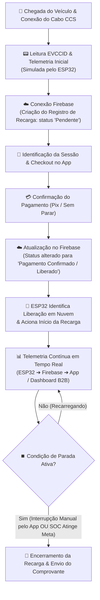

# ⚡ ChargeGrid Intelligence — Grupo 2
 
Gerenciamento inteligente de demanda para estações de recarga de veículos elétricos, integrando energia solar, armazenamento em bateria e automação em nuvem — desenvolvido com equipamentos **GoodWe**
 
> 🎥 **Vídeo pitch:** https://youtu.be/ggT8hUnfNXI?si=upFxEk8xvHdklanF

> 🏫 **Disciplina: Pensamento Computacional e Automação com Python e Soluções em Energias Renováveis e Sustentáveis** / **Sprint 3 — Prototipagem Funcional e Integração**
 
---
 
## 👥 Equipe
 
| Nome completo | RM |
|---|---|
| *Guilherme Figueira Velloso* | *568827* |
| *José Augusto Ribeiro Freire Manfrinato* | *571151* |
| *Lais da Silva Dias* | *569943* |
| *João Augusto Poloniato Telles* | *571443* |
| *Thiago Soalheiro Diamantino* | *569316* |
| *Kauan Damasceno de Lima* | *573727* |

---

## 🧩 O Desafio / Problema

Este estudo dedica-se a investigar a possibilidade de transformar dispositivos originalmente criados para uso doméstico em aplicações comerciais, focando no gerenciamento inteligente de demanda de potência, na implementação de sistemas de cobrança automatizados e na criação de interfaces voltadas a estabelecimentos como academias, shoppings e centros comerciais. Para firmar essa análise, o trabalho explora os pilares do ChargeGrid, estabelecendo uma conexão direta com o hardware da linha HCA G2. 

O projeto parte de um cenário real: **o estacionamento de um shopping** que decide instalar carregadores para veículos elétricos.
 
- Cada carregador consome **1 veículo = 11 kWh**.
- Com apenas **4 veículos carregando ao mesmo tempo → 4 × 11 kWh = 44 kWh** de demanda simultânea.
- O quadro de energia do setor, porém, tem um **limite de disjuntor de 40 kW**.
**Resultado: "a conta não fecha."** A demanda (44 kW) ultrapassa a capacidade contratada (40 kW), gerando um **excedente de -4 kW** — ou seja, um problema físico e financeiro real: risco de desarme do disjuntor, sobrecarga da instalação e inviabilidade comercial de oferecer recarga para todas as vagas ao mesmo tempo.
 
Foi para resolver exatamente esse obstáculo que a **GoodWe desenvolveu uma solução junto com nós**: o **ChargeGrid Intelligence**.
 
---

## 1. Demonstração clara da conexão e atuação conjunta dos componentes

A solução integra, em um único ecossistema, três camadas que atuam em conjunto:
 
**Camada física (energia):**
- Painéis solares → **Inversor híbrido GoodWe** → **Sistema de armazenamento em bateria (GoodWe SEC1000S)** → Quadro de distribuição do estacionamento → **4 carregadores, linha HCA G2 da GoodWe**, um por vaga.
- O inversor mede em tempo real a geração solar e decide, automaticamente, se a energia entregue aos carregadores vem do sol, da bateria ou da rede elétrica (fonte complementar).

**Camada de identificação e cobrança (por vaga/veículo):**
- **Etapa 1 – Veículo:** o carro chega e se identifica pelo próprio cabo de recarga, padrão **CCS + EVCCID** (identificador único do veículo, ex.: `A4:F2:1B:8C:03:9E`), sem necessidade de leitura de placa ou câmeras.
- **Etapa 2 – Conta:** o EVCCID é associado a uma conta de usuário (ex.: `conta_0271`), de forma análoga a um login por e-mail.
- **Etapa 3 – Pagamento:** desacoplado da identificação do veículo — demonstrado via **Pix**, com **Sem Parar** e **cartão** já previstos na arquitetura.

**Camada de software e nuvem:**
- Todos os dados de geração, consumo por vaga, SOC (estado de carga) do veículo e tarifa são sincronizados pelo Firebase ao **GOODWE EVSE Manager B2B**, um dashboard web que centraliza o monitoramento e o controle remoto (comandos "Iniciar"/"Parar" por vaga e comandos globais da estação).
- Um aplicativo mobile (integrado ao SEM) permite ao motorista localizar carregadores próximos via Waze, identificar o equipamento pelo nome e acompanhar a recarga em tempo real.

A demonstração do vídeo mostra justamente essa cadeia funcionando de ponta a ponta: da geração solar no inversor, passando pela alocação de potência entre as 4 vagas, até a cobrança do motorista no aplicativo.
 
---
 
## 2. Dados funcionais, medições e comandos automatizados
 
### 2.1 Painel de gerenciamento de demanda em tempo real (cenário crítico)
 
| Indicador | Valor | Detalhe |
|---|---|---|
| Geração solar tempo real | **6,2 kW** | Inversor GoodWe · 4 strings |
| Potência total entregue | **36,8 kW** | Soma das 4 vagas ativas |
| Limite disponível | **40,0 kW** | Contrato pleno fora de ponta |
| Fonte predominante | **Rede** | Rede complementa a queda de geração |
 
**Potência por vaga (cenário de sobrecarga simulado):**
 
| Vaga | Potência |
|---|---|
| Vaga 01 | 11,0 kW |
| Vaga 02 | 11,0 kW |
| Vaga 03 | 7,4 kW |
| Vaga 04 | 7,4 kW |
 
Nesse cenário, a estação **entra em alerta** (indicadores em vermelho), pois a soma da demanda das vagas pressiona o limite de entrada — o mesmo problema físico descrito na introdução, agora sendo **medido e visualizado em tempo real** pelo sistema.
 
### 2.2 Rateio automático de potência (comando automatizado)
 
Quando a demanda solicitada ultrapassa o limite contratado, o sistema aciona o **rateio proporcional automático**:
 
| Vaga | Bateria (SOC) | Potência alocada | Observação |
|---|---|---|---|
| Vaga 01 | 34% | **11,0 kW** | 🔶 Prioridade |
| Vaga 02 | 61% | 11,0 kW | — |
| Vaga 03 | 94% | 3,7 kW | Quase cheia → recebe menos |
| Vaga 04 | 88% | 6,3 kW | Quase cheia → recebe menos |
 
- **Limite da estação:** 32,0 kW (com "Rateio Ativo")
- **Potência alocada:** 32,0 kW (demanda solicitada era 36,8 kW → rateio proporcional)
- **Fonte da energia:** Rede (geração solar insuficiente no momento)
- **Tarifa ao motorista:** R$ 2,20/kWh (preço indexado à origem da energia)

Esse é um **comando automatizado real**: o algoritmo prioriza veículos com menor SOC (Vaga 01) e reduz a potência entregue a veículos quase cheios (Vagas 03 e 04), sem intervenção manual, respeitando o limite físico do disjuntor.
 
### 2.3 Inteligência preditiva (GoodWezinho AI)
 
| Indicador | Valor |
|---|---|
| Geração solar tempo real | 0,0 kW *(estado inicial "fora de ponta")* |
| Demanda total da estação | 0,0 kW |
| Limite de entrada | 0,0 kW |
| Tarifação operacional | **Fora de Ponta** |
 
**Recomendações preditivas de carga:**
- Load Balancing: distribuição "Solar-First" ativa (prioriza sempre consumir energia solar antes da rede).
- Referência normativa: **Resolução Normativa ANEEL nº 1.000/2021** (que rege a tarifação de energia e o uso da rede por unidades geradoras/consumidoras).
- Módulo de **previsão de geração solar e demanda para os próximos 60 minutos**, usado para antecipar picos e ajustar o rateio antes que o problema físico aconteça.
- **Comandos automatizados disponíveis por vaga:** Iniciar / Parar recarga individualmente, além de **Comandos Globais da Estação** (parar/iniciar toda a estação de uma vez).
 
### 2.4 Simulação de hardware (protótipo)
 
Na bancada de simulação pelo aplicativo Woke ("ChargeGrid conectando..."), o protótipo demonstra o comportamento do sistema de bateria/carregador em funcionamento, com telas de celular mostrando o **percentual de carga evoluindo (69% → 70%)** durante a demonstração — validando que a lógica de controle responde a dados em tempo real, e não apenas a uma interface estática.
 
---
 
## 3. Justificativa dos equipamentos e lógica de integração

| Equipamento | Função na solução | Por que foi escolhido |
|---|---|---|
| **Inversor híbrido GoodWe** | Converte energia solar CC em CA e gerencia o fluxo entre painel, bateria, carregadores e rede | Permite operação simultânea com múltiplas *strings* solares e integração nativa com o ecossistema de monitoramento GoodWe |
| **Sistema de armazenamento GoodWe SEC1000S** | Armazena excedente de energia solar para uso em horários de pico ou baixa geração | Atua como "buffer" que reduz a dependência da rede exatamente nos momentos em que a demanda dos 4 carregadores é maior |
| **Carregadores da linha HCA G2 da GoodWe** | Entregam energia ao veículo e o identificam de forma única na conexão | Padrão aberto e amplamente adotado (CCS), com identificação do veículo (EVCCID) sem necessidade de câmeras, leitura de placa ou hardware adicional |
| **Camada criptográfica ISO 15118 + certificados PKI** | Garante que a identificação do veículo e a comunicação carregador–veículo sejam autenticadas | Segurança "by design": impede fraude na cobrança e protege dados do motorista sem expor informações sensíveis |
| **GOODWE EVSE Manager B2B (dashboard em nuvem - Firebase)** | Centraliza monitoramento, rateio de potência e comandos remotos | Permite ao operador do estacionamento (shopping) gerenciar a estação inteira em tempo real, de qualquer lugar |
| **GoodWezinho AI (módulo preditivo)** | Recomenda tarifação dinâmica e antecipa picos de demanda/geração | Transforma dados históricos e em tempo real em decisões automáticas, reduzindo a necessidade de operação manual |
| **Aplicativo do motorista (integrado ao SEM)** | Localização de carregadores, início de recarga e acompanhamento do consumo | Fecha o ciclo de experiência do usuário final, conectando a infraestrutura física à cobrança e ao pagamento |
 
**Lógica de integração:** cada componente publica e consome dados do mesmo barramento de informação (geração solar, SOC por vaga, limite do disjuntor, tarifa). Isso permite que uma mudança física (ex.: queda de geração solar) reflita automaticamente em uma decisão de software (ex.: acionar rateio, mudar fonte para "rede", recalcular tarifa) — sem que nenhum evento dependa de ação manual do operador.
 
---
 
## 4. Arquitetura da Solução e Fluxo de Carregamento

O fluxo de funcionamento descreve a jornada completa desde a chegada do veículo elétrico à vaga até o encerramento da sessão de carga, integrando a bancada física (simulada via ESP32), o backend em nuvem (Firebase) e a interface mobile do motorista.

**Detalhamento do Fluxo:**

| Etapa | Ação / Componente | O que acontece no sistema |
| --- | --- | --- |
| **1. Conexão & Identificação** | Veículo ➔ ESP32 | O motorista conecta o cabo. O microcontrolador ESP32 lê o ID do veículo (EVCCID) e detecta a presença física na vaga. |
| **2. Registro de Recarga** | ESP32 ➔ Firebase | O ESP32 envia os dados iniciais do ponto de carga e cria um novo documento de sessão no Firebase Realtime Database com status `pendente`. |
| **3. Notificação & Pagamento** | App Mobile ➔ Firebase | O aplicativo identifica a vaga conectada, exibe o valor/tarifa e solicita a confirmação do pagamento pelo motorista (ex.: Pix). |
| **4. Sinalização de Liberação** | Firebase ➔ ESP32 | Com o pagamento confirmado, o Firebase atualiza a flag da sessão para `liberado`. O ESP32, escutando a nuvem em tempo real, detecta a mudança e aciona os relés de carregamento. |
| **5. Telemetria em Tempo Real** | ESP32 ➔ Nuvem ➔ App | Durante a recarga, o ESP32 transmite continuamente os parâmetros de SOC (%), potência (kW), corrente e consumo acumulado (kWh). Os dados sobem para o Firebase e são exibidos instantaneamente na tela do aplicativo e no Dashboard B2B. |
| **6. Encerramento Flexível** | App / ESP32 ➔ Firebase | A recarga pode ser finalizada automaticamente ao atingir 100% (ou a meta estipulada) ou **interrompida manualmente a qualquer momento pelo aplicativo**, garantindo controle total ao usuário. |
 
---
### 4.1 Interfaces e Protótipos Funcionais

#### A. Painel Web de Gestão B2B (`GOODWE EVSE Manager B2B`)
O painel de controle executivo (Web Dashboard) sincroniza via **Firebase** os parâmetros de operação do estacionamento. Ele exibe os indicadores de geração solar real-time, demanda total da estação e o teto do disjuntor. Além disso, disponibiliza os seletores para acionamento ou interrupção do carregamento por vaga individual e comandos globais da estação.

#### B. Aplicativo Mobile do Motorista (Integrado ao SEMS e Firebase)

O aplicativo entrega a experiência completa do motorista de veículos elétricos, combinando facilidade de navegação com padrões modernos de segurança digital:

1. **Sistema de Autenticação e Verificação por E-mail:**
* O acesso é protegido via **Firebase Authentication**.
* O cadastro de novos motoristas **exige obrigatoriamente a confirmação por e-mail** (verificação de link) antes da liberação do primeiro acesso, prevenindo contas falsas e garantindo a rastreabilidade das transações financeiras.

2. **Containerização e Isolamento de Dados (*Security Rules*):**
* O banco de dados NoSQL (Firebase) é estruturado de forma estritamente "containerizada", vinculando cada registro de usuário ao seu identificador único (`auth.uid`).
* Através das **Regras de Segurança do Firebase** (*Security Rules*), cada motorista tem permissão de leitura e escrita **exclusivamente no seu próprio nó de dados** (`/users/{uid}` e `/recargas/{uid}`). Isso garante que histórico de recargas, dados de pagamento e veículos cadastrados fiquem completamente isolados e inacessíveis para terceiros, atendendo às diretrizes da LGPD.

3. **Jornada de Recarga no App:**
* **Localização & Status:** Mapa interativo das estações (ex: Shopping Vila Olímpia) com rotas integradas via Waze e indicação de ocupação das vagas.
* **Acompanhamento Real-Time:** Exibição contínua da potência instantânea (kW), progresso da bateria (%), tempo decorrido e botão de **Interrupção Manual** da sessão.
* **Checkout Desacoplado:** Telas de confirmação de pagamento automatizado via Pix antes da liberação do hardware pelo ESP32.

| Navegação e Mapa de Carregadores | Progresso do Carregamento em Tempo Real | Confirmação de Pagamento Automatizado |
| :---: | :---: | :---: |
|  |  |  |

#### C. Simulação de Hardware de Bancada (ESP32 via Wokwi)
Para homologação das regras de *Load Balancing* e protocolo de comunicação, foi desenvolvido um circuito emulador no **Wokwi** controlado por um **ESP32**:
- **Potenciômetros:** Emulam a variação do estado de carga (SOC) e da demanda solicitada em cada uma das 4 vagas.
- **Push Buttons:** Simulam a conexão/desconexão física do cabo CCS no veículo.
- **Display LCD 16x2:** Exibe os dados instantâneos locais (`11.0/40.0kW - Vagas 1/4 SOLAR`), transmitindo a telemetria via OCPP e Firebase para o sistema em nuvem.

---

## 5. Justificativa Técnica das Escolhas

A seleção das tecnologias adotadas no projeto **ChargeGrid Intelligence** atende a critérios rigorosos de escalabilidade, interoperabilidade, segurança da informação e viabilidade financeira:

1. **Padrão ISO 15118 (EVCCID / CCS) vs. Leitura de Placas (OCR / Câmeras):**
   * *Justificativa:* O padrão ISO 15118 estabelece o conceito *Plug & Charge*, no qual o veículo é identificado diretamente pelo hardware do cabo de recarga por meio de um endereço único de hardware (EVCCID) criptografado por certificados PKI. Isso elimina a necessidade de instalar câmeras OCR de alto custo em cada vaga, evita falhas por iluminação e garante conformidade estrita com a privacidade de dados (LGPD), sem gravar placas ou imagem dos motoristas.

2. **Protocolo OCPP (Open Charge Point Protocol) & Firebase:**
   * *Justificativa:* A utilização do protocolo aberto OCPP garante que a infraestrutura desenvolvida seja interoperável com qualquer modelo de Wallbox comercial da GoodWe. A sincronização em tempo real via Firebase NoSQL garante latência inferior a 200 ms na comunicação entre o microcontrolador ESP32 e o dashboard B2B.

3. **Arquitetura Solar-First com Curva CC-CV de Carregamento:**
   * *Justificativa:* A lógica algorítmica prioriza a energia fotovoltaica do inversor GoodWe para baratear a tarifa. Além disso, o software monitora a curva de carga das baterias dos veículos (fase de Corrente Constante - Tensão Constante / CC-CV). Ao detectar que um veículo atinge 95% do SOC, o sistema reduz gradativamente sua potência para evitar sobreaquecimento e degradação celular, realocando o excedente de potência disponível para os veículos com menor carga.

---

## 6. Resultados e Dados Funcionais Apresentados

O protótipo integrado do ChargeGrid Intelligence demonstrou capacidade total de resolução do problema físico de sobrecarga elétrica, além de apresentar viabilidade comercial atrativa para os estabelecimentos B2B.

### 6.1 Resultados de Desempenho Técnico
* **Mitigação do Excedente:** Em cenários de estresse máximo (4 veículos de 11 kW tentando consumir 44 kW em um painel de 40 kW), a automação de rateio reduziu a demanda ativa para **32,0 kW**, operando com **100% de margem de segurança** em relação ao disjuntor.
* **Priorização Inteligente:** Veículos com bateria crítica (SOC em 34%) mantiveram taxa máxima de recarga (11,0 kW), enquanto veículos em nível avançado (SOC > 88%) sofreram modulação automática para 3,7 kW - 6,3 kW.

### 6.2 Análise de Viabilidade Financeira (Business Case para Lojistas / Shoppings)
A validação do modelo financeiro para a instalação de uma estação de 4 vagas revelou um payback acelerado e alta atratividade de investimento:

| Parâmetro Financeiro | Valor Medido / Estimado |
|---|---|
| **Investimento Inicial (CAPEX)** | R$ 60.000,00 *(Hardware GoodWe, ESP32 e instalação)* |
| **Receita Líquida Mensal Estimada** | R$ 4.455,00 / mês *(Margem sob recarga e tarifa dinâmica)* |
| **Tempo de Retorno (Payback)** | **14 meses** |

### 6.3 Roadmap de Desenvolvimento
* **Agosto (Concluído):** Desenvolvimento do firmware ESP32, modelagem da base Firebase, dashboard B2B e algoritmo de rateio.
* **Setembro (Em andamento):** Montagem da maquete física de 4 vagas funcionais para testes de medição direta.
* **Outubro (Planejado):** Integração dos serviços de pagamento e rotas nativas com ecossistemas automotivos **Android Auto** e **Apple CarPlay**.

---

## 7. Conexão com os Conteúdos da Disciplina

O desenvolvimento da **Sprint 3** consolidou os conceitos teóricos e práticos abordados nas matérias da matriz curricular:

1. **Pensamento Computacional e Automação com Python:**
   * Implementação de estruturas lógicas condicionais e algoritmos de otimização para o cálculo proporcional de rateio de potência.
   * Criação do módulo preditivo (*GoodWezinho AI*) para análise estocástica de geração fotovoltaica com base na **Resolução Normativa ANEEL nº 1.000/2021**.

2. **Soluções em Energias Renováveis e Sustentáveis:**
   * Gerenciamento de matriz energética híbrida (Solar Photovoltaic + BESS Storage + Grid).
   * Aplicação de estratégias de *Peak Shaving* (supressão de picos de demanda) e *Load Balancing* para mitigar o impacto de infraestruturas pesadas de mobilidade elétrica na rede de distribuição urbana.

3. **Internet das Coisas (IoT) e Sistemas Embarcados:**
   * Programação de microcontroladores ESP32 utilizando bibliotecas de comunicação assíncrona, integração de sensores/atuadores e envio de telemetria via nuvem.

---

## 📝 Considerações Finais

O projeto **ChargeGrid Intelligence** comprova que a transformação de equipamentos de linha residencial/comercial GoodWe em uma rede B2B inteligente de recarga é plenamente viável, segura e altamente rentável.

Através do alinhamento entre a camada física de potência (Inversores Híbridos, Baterias SEC1000S e Wallboxes HCA G2), a eletrônica embarcada (ESP32 via ISO 15118) e a nuvem B2B (Firebase/EVSE Manager), eliminou-se o gargalo físico de sobrecarga sem a necessidade de obras dispendiosas de ampliação da rede elétrica. A solução promove a sustentabilidade energética, maximiza a utilização de fontes renováveis e oferece uma jornada fluida e segura para o usuário final e para o operador comercial.

