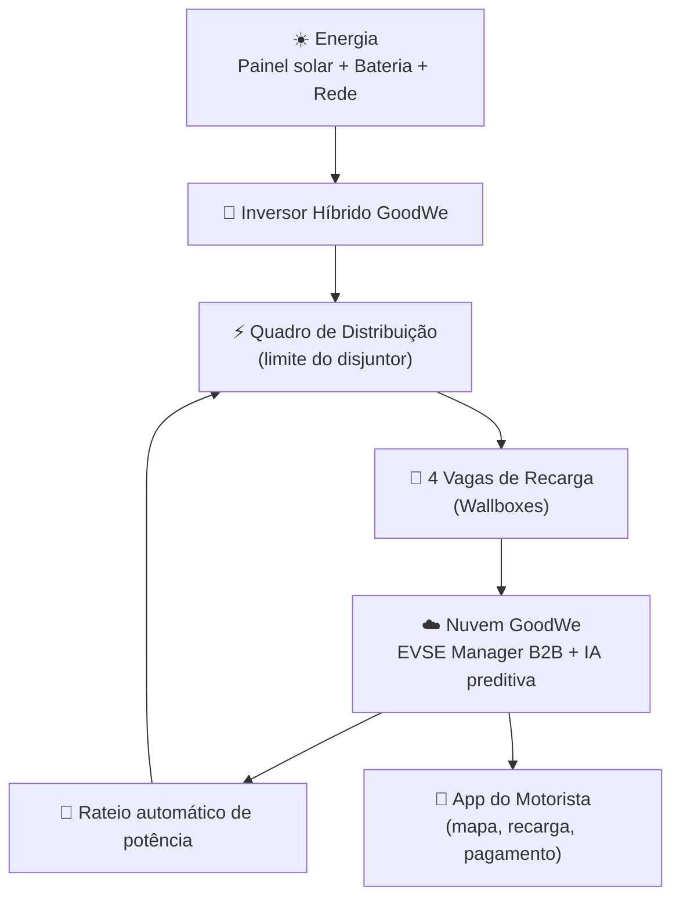

# ⚡ ChargeGrid Intelligence — Grupo 2
 
Gerenciamento inteligente de demanda para estações de recarga de veículos elétricos, integrando energia solar, armazenamento em bateria e automação em nuvem — desenvolvido com equipamentos **GoodWe**
 
> 🎥 **Vídeo pitch:** https://youtu.be/ggT8hUnfNXI?si=upFxEk8xvHdklanF

> 🏫 **Disciplina: Pensamento Computacional e Automação com Python e Soluções em Energias Renováveis e Sustentáveis** / **Sprint 3 — Prototipagem Funcional e Integração**
 
---
 
## 👥 Equipe
 
| Nome completo | RM |
|---|---|
| *Guilherme Figueira Velloso* | *568827* |
| *José Augusto Ribeiro Freire Manfrinato* | *571151* |
| *Lais da Silva Dias* | *569943* |
| *João Augusto Poloniato Telles* | *571443* |
| *Thiago Soalheiro Diamantino* | *569316* |
| *Kauan Damasceno de Lima* | *573727* |

---

## 🧩 O Desafio / Problema

Este estudo dedica-se a investigar a possibilidade de transformar dispositivos originalmente criados para uso doméstico em aplicações comerciais, focando no gerenciamento inteligente de demanda de potência, na implementação de sistemas de cobrança automatizados e na criação de interfaces voltadas a estabelecimentos como academias, shoppings e centros comerciais. Para firmar essa análise, o trabalho explora os pilares do ChargeGrid, estabelecendo uma conexão direta com o hardware da linha HCA G2. 

O projeto parte de um cenário real: **o estacionamento de um shopping** que decide instalar carregadores para veículos elétricos.
 
- Cada carregador consome **1 veículo = 11 kWh**.
- Com apenas **4 veículos carregando ao mesmo tempo → 4 × 11 kWh = 44 kWh** de demanda simultânea.
- O quadro de energia do setor, porém, tem um **limite de disjuntor de 40 kW**.
**Resultado: "a conta não fecha."** A demanda (44 kW) ultrapassa a capacidade contratada (40 kW), gerando um **excedente de -4 kW** — ou seja, um problema físico e financeiro real: risco de desarme do disjuntor, sobrecarga da instalação e inviabilidade comercial de oferecer recarga para todas as vagas ao mesmo tempo.
 
Foi para resolver exatamente esse obstáculo que a **GoodWe desenvolveu uma solução junto com nós**: o **ChargeGrid Intelligence**.
 
---

## 1. Demonstração clara da conexão e atuação conjunta dos componentes

A solução integra, em um único ecossistema, três camadas que atuam em conjunto:
 
**Camada física (energia):**
- Painéis solares → **Inversor híbrido GoodWe** → **Sistema de armazenamento em bateria (GoodWe SEC1000S)** → Quadro de distribuição do estacionamento → **4 carregadores, linha HCA G2 da GoodWe**, um por vaga.
- O inversor mede em tempo real a geração solar e decide, automaticamente, se a energia entregue aos carregadores vem do sol, da bateria ou da rede elétrica (fonte complementar).

**Camada de identificação e cobrança (por vaga/veículo):**
- **Etapa 1 – Veículo:** o carro chega e se identifica pelo próprio cabo de recarga, padrão **CCS + EVCCID** (identificador único do veículo, ex.: `A4:F2:1B:8C:03:9E`), sem necessidade de leitura de placa ou câmeras.
- **Etapa 2 – Conta:** o EVCCID é associado a uma conta de usuário (ex.: `conta_0271`), de forma análoga a um login por e-mail.
- **Etapa 3 – Pagamento:** desacoplado da identificação do veículo — demonstrado via **Pix**, com **Sem Parar** e **cartão** já previstos na arquitetura.

**Camada de software e nuvem:**
- Todos os dados de geração, consumo por vaga, SOC (estado de carga) do veículo e tarifa são sincronizados pelo Firebase ao **GOODWE EVSE Manager B2B**, um dashboard web que centraliza o monitoramento e o controle remoto (comandos "Iniciar"/"Parar" por vaga e comandos globais da estação).
- Um aplicativo mobile (integrado ao SEM) permite ao motorista localizar carregadores próximos via Waze, identificar o equipamento pelo nome e acompanhar a recarga em tempo real.

A demonstração do vídeo mostra justamente essa cadeia funcionando de ponta a ponta: da geração solar no inversor, passando pela alocação de potência entre as 4 vagas, até a cobrança do motorista no aplicativo.
 
---
 
## 2. Dados funcionais, medições e comandos automatizados
 
### 2.1 Painel de gerenciamento de demanda em tempo real (cenário crítico)
 
| Indicador | Valor | Detalhe |
|---|---|---|
| Geração solar tempo real | **6,2 kW** | Inversor GoodWe · 4 strings |
| Potência total entregue | **36,8 kW** | Soma das 4 vagas ativas |
| Limite disponível | **40,0 kW** | Contrato pleno fora de ponta |
| Fonte predominante | **Rede** | Rede complementa a queda de geração |
 
**Potência por vaga (cenário de sobrecarga simulado):**
 
| Vaga | Potência |
|---|---|
| Vaga 01 | 11,0 kW |
| Vaga 02 | 11,0 kW |
| Vaga 03 | 7,4 kW |
| Vaga 04 | 7,4 kW |
 
Nesse cenário, a estação **entra em alerta** (indicadores em vermelho), pois a soma da demanda das vagas pressiona o limite de entrada — o mesmo problema físico descrito na introdução, agora sendo **medido e visualizado em tempo real** pelo sistema.
 
### 2.2 Rateio automático de potência (comando automatizado)
 
Quando a demanda solicitada ultrapassa o limite contratado, o sistema aciona o **rateio proporcional automático**:
 
| Vaga | Bateria (SOC) | Potência alocada | Observação |
|---|---|---|---|
| Vaga 01 | 34% | **11,0 kW** | 🔶 Prioridade |
| Vaga 02 | 61% | 11,0 kW | — |
| Vaga 03 | 94% | 3,7 kW | Quase cheia → recebe menos |
| Vaga 04 | 88% | 6,3 kW | Quase cheia → recebe menos |
 
- **Limite da estação:** 32,0 kW (com "Rateio Ativo")
- **Potência alocada:** 32,0 kW (demanda solicitada era 36,8 kW → rateio proporcional)
- **Fonte da energia:** Rede (geração solar insuficiente no momento)
- **Tarifa ao motorista:** R$ 2,20/kWh (preço indexado à origem da energia)

Esse é um **comando automatizado real**: o algoritmo prioriza veículos com menor SOC (Vaga 01) e reduz a potência entregue a veículos quase cheios (Vagas 03 e 04), sem intervenção manual, respeitando o limite físico do disjuntor.
 
### 2.3 Inteligência preditiva (GoodWezinho AI)
 
| Indicador | Valor |
|---|---|
| Geração solar tempo real | 0,0 kW *(estado inicial "fora de ponta")* |
| Demanda total da estação | 0,0 kW |
| Limite de entrada | 0,0 kW |
| Tarifação operacional | **Fora de Ponta** |
 
**Recomendações preditivas de carga:**
- Load Balancing: distribuição "Solar-First" ativa (prioriza sempre consumir energia solar antes da rede).
- Referência normativa: **Resolução Normativa ANEEL nº 1.000/2021** (que rege a tarifação de energia e o uso da rede por unidades geradoras/consumidoras).
- Módulo de **previsão de geração solar e demanda para os próximos 60 minutos**, usado para antecipar picos e ajustar o rateio antes que o problema físico aconteça.
- **Comandos automatizados disponíveis por vaga:** Iniciar / Parar recarga individualmente, além de **Comandos Globais da Estação** (parar/iniciar toda a estação de uma vez).
 
### 2.4 Simulação de hardware (protótipo)
 
Na bancada de simulação pelo aplicativo Woke ("ChargeGrid conectando..."), o protótipo demonstra o comportamento do sistema de bateria/carregador em funcionamento, com telas de celular mostrando o **percentual de carga evoluindo (69% → 70%)** durante a demonstração — validando que a lógica de controle responde a dados em tempo real, e não apenas a uma interface estática.
 
---
 
## 3. Justificativa dos equipamentos e lógica de integração

| Equipamento | Função na solução | Por que foi escolhido |
|---|---|---|
| **Inversor híbrido GoodWe** | Converte energia solar CC em CA e gerencia o fluxo entre painel, bateria, carregadores e rede | Permite operação simultânea com múltiplas *strings* solares e integração nativa com o ecossistema de monitoramento GoodWe |
| **Sistema de armazenamento GoodWe SEC1000S** | Armazena excedente de energia solar para uso em horários de pico ou baixa geração | Atua como "buffer" que reduz a dependência da rede exatamente nos momentos em que a demanda dos 4 carregadores é maior |
| **Carregadores da linha HCA G2 da GoodWe** | Entregam energia ao veículo e o identificam de forma única na conexão | Padrão aberto e amplamente adotado (CCS), com identificação do veículo (EVCCID) sem necessidade de câmeras, leitura de placa ou hardware adicional |
| **Camada criptográfica ISO 15118 + certificados PKI** | Garante que a identificação do veículo e a comunicação carregador–veículo sejam autenticadas | Segurança "by design": impede fraude na cobrança e protege dados do motorista sem expor informações sensíveis |
| **GOODWE EVSE Manager B2B (dashboard em nuvem - Firebase)** | Centraliza monitoramento, rateio de potência e comandos remotos | Permite ao operador do estacionamento (shopping) gerenciar a estação inteira em tempo real, de qualquer lugar |
| **GoodWezinho AI (módulo preditivo)** | Recomenda tarifação dinâmica e antecipa picos de demanda/geração | Transforma dados históricos e em tempo real em decisões automáticas, reduzindo a necessidade de operação manual |
| **Aplicativo do motorista (integrado ao SEM)** | Localização de carregadores, início de recarga e acompanhamento do consumo | Fecha o ciclo de experiência do usuário final, conectando a infraestrutura física à cobrança e ao pagamento |
 
**Lógica de integração:** cada componente publica e consome dados do mesmo barramento de informação (geração solar, SOC por vaga, limite do disjuntor, tarifa). Isso permite que uma mudança física (ex.: queda de geração solar) reflita automaticamente em uma decisão de software (ex.: acionar rateio, mudar fonte para "rede", recalcular tarifa) — sem que nenhum evento dependa de ação manual do operador.
 
---
 
## 4. Arquitetura da solução e fluxo de sistema

A arquitetura pode ser lida em **4 blocos simples, de cima para baixo**: primeiro a energia é gerada, depois ela é distribuída aos carregadores, em seguida os dados sobem para a nuvem para decisão automática, e por fim o motorista interage com tudo isso pelo aplicativo.
 

 
**Como ler o fluxo:**
 
| Etapa | O que acontece |
|---|---|
| 1️⃣ Energia | Sol, bateria e rede alimentam o inversor GoodWe, que decide a melhor fonte disponível |
| 2️⃣ Distribuição | O inversor entrega energia ao quadro, que reparte a potência entre as 4 vagas, respeitando o limite físico do disjuntor |
| 3️⃣ Nuvem | Os dados de cada vaga (consumo, SOC, geração) sobem para o EVSE Manager B2B, onde a IA preditiva analisa a situação |
| 4️⃣ Rateio automático | Se a demanda ultrapassa o limite, a nuvem manda um comando de volta ao quadro, redistribuindo a potência entre as vagas — fechando o ciclo |
| 5️⃣ App do motorista | Em paralelo, o motorista acompanha localização, recarga e cobrança pelo aplicativo, que também consulta a mesma nuvem |
 
> 💡 A identificação do veículo e o pagamento (Veículo → Conta → Pagamento, detalhados na seção 1) acontecem dentro do bloco "4 Vagas de Recarga", no momento em que o cabo é conectado — por isso não aparecem como uma camada separada neste diagrama simplificado.
 
---

## 5.
